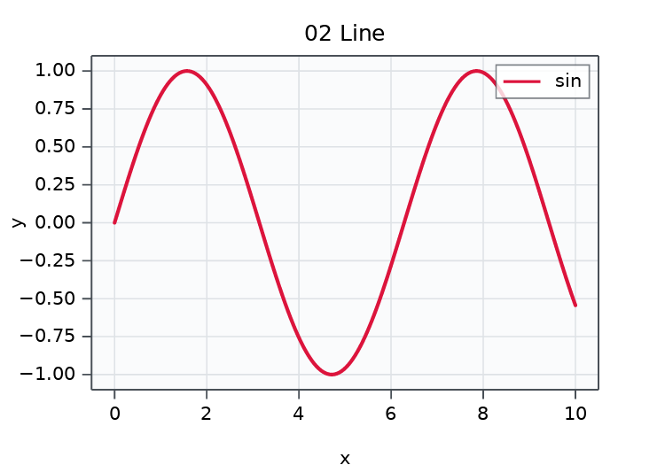
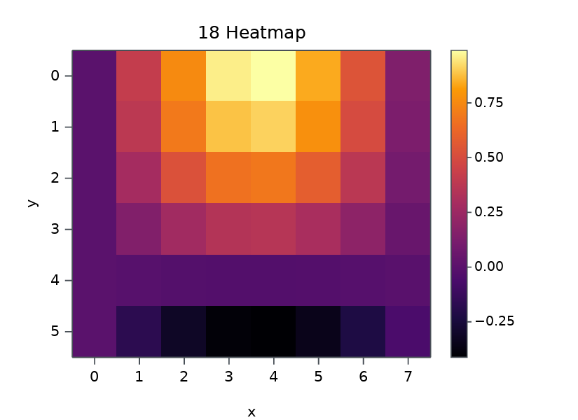
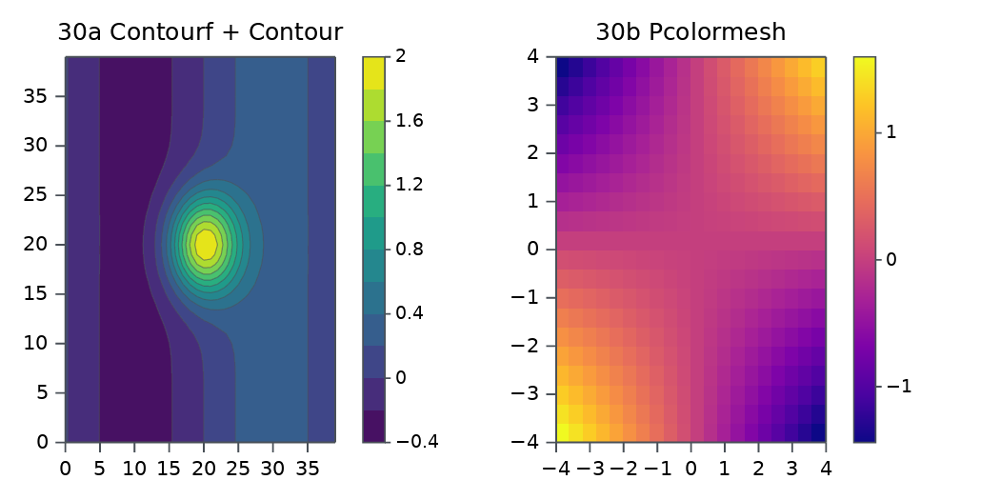
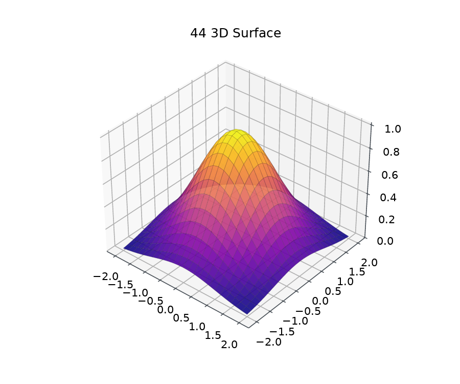
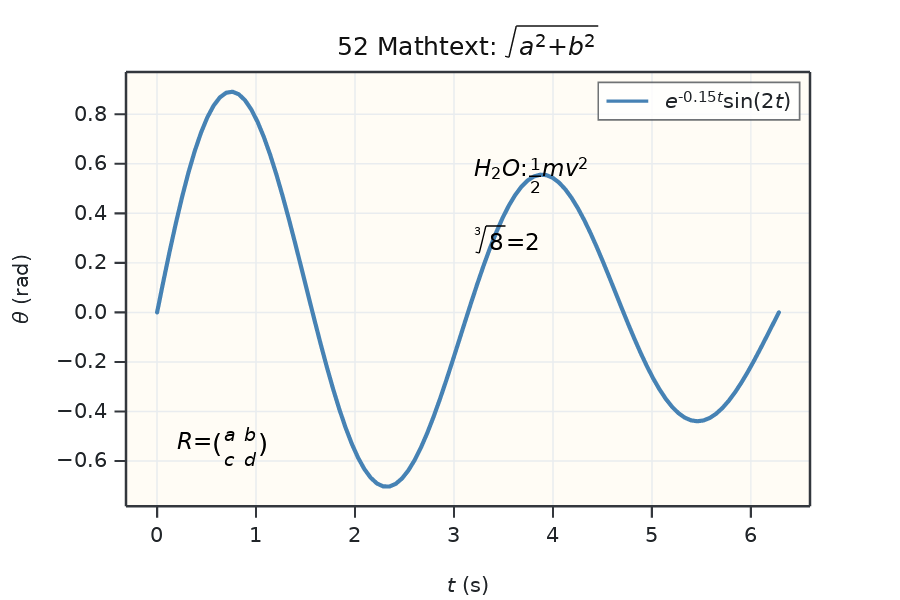
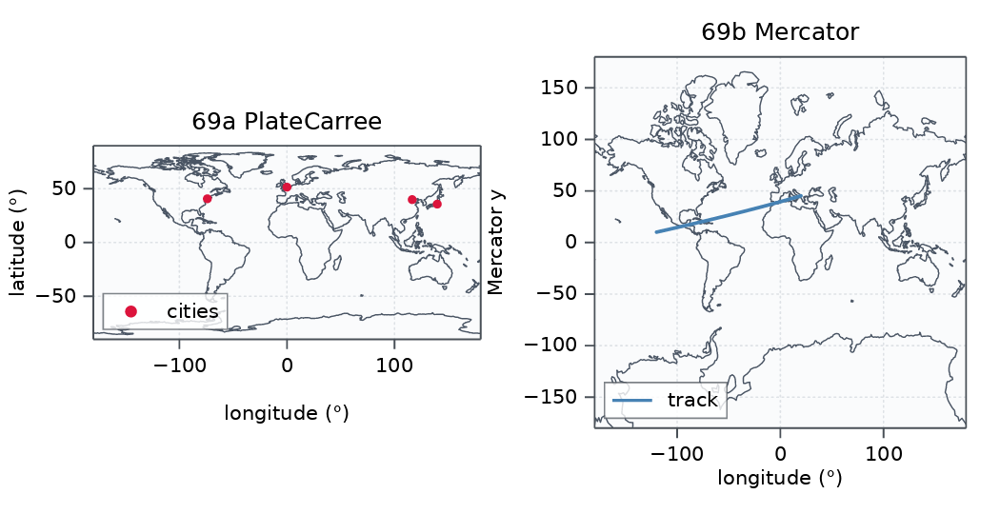

# plotine

[English](README.md) | **中文**

一个高层、LLM 友好的 **Rust 原生科学绘图库**（静态 2D + 基础 3D）。

> 出版级默认样式、编译期类型安全 API、带修复建议的错误信息。视觉默认值对标 matplotlib——API 保持 Rust 原生风格。

## 状态

**v0.5.1** — 核心静态图表（M0–M8）+ 交互 GUI、动画、地理投影、pyplot 门面、LaTeX、
PGF/EPS/MP4、Widget、stats/GeoJSON、文档（M9–M17）全部完成。
功能对比评分：[`docs/MPL_GAP.md`](docs/MPL_GAP.md)。

## 示例

<p align="center">
  
  
  
</p>
<p align="center">
  
  
  
</p>

完整集合：`cargo run -p plotine --example gallery` → `./gallery/`。

## 安装

```toml
plotine = "0.5"
# 可选功能：
# plotine = { version = "0.5", features = ["gui", "gif", "mp4", "eps", "latex"] }
```

## 快速上手

```rust
use plotine::prelude::*;

fn main() -> plotine::Result<()> {
    let x: Vec<f64> = (0..100).map(|i| i as f64 * 0.1).collect();
    let y: Vec<f64> = x.iter().map(|v| v.sin()).collect();

    Figure::new()
        .subplots(2, 1, |g| {
            g.at(0, 0, |ax| {
                ax.line(&x, &y).color(Color::CRIMSON).width(2.0);
                ax.title("Top");
            });
            g.at(1, 0, |ax| {
                ax.scatter(&x, &y).size(3.0);
                ax.title("Bottom");
            });
        })
        .save("out.png")?; // 也支持 .svg / .pdf
    Ok(())
}
```

```bash
cargo run -p plotine --example gallery                 # → ./gallery/ (69 张图)
cargo run -p plotine --example matplotlib_compare      # → ./compare/plotine_*.png
python scripts/matplotlib_compare.py                   # → ./compare/mpl_*.png + index.html
cargo run -p plotine --example interactive_show --features gui  # 交互窗口：平移/缩放/3D 旋转
cargo run -p plotine --example animate_wave --features "gif,mp4" # PNG + GIF + 可选 MP4
cargo run -p plotine --example export_formats                   # png/svg/pdf/pgf (+ eps)
```

```rust
// Polars 集成：DataFrame 转绘图只需三行
let (x, y) = plotine::polars::xy(&df, "x", "y")?;
Figure::new().axes(|ax| { ax.line(&x, &y); }).save("out.png")?;

// evcxr Jupyter 内联显示（feature = "evcxr"）
Figure::new().axes(|ax| { ax.line(&x, &y); }).evcxr_display()?;
```

## 性能

端到端 `Figure` 构建 + 导出（release 模式，7 次迭代中位数，2 次预热；
5.0×3.5 英寸 @ 150 DPI）。

| 场景 | plotine | matplotlib | 加速比 |
|---|---:|---:|---:|
| `series.line_n10000` | ~16 ms | ~42 ms | ~2.7× |
| `stat.heatmap_128` | ~24 ms | ~52 ms | ~2.2× |
| `d3.surface_40` | ~42 ms | ~92 ms | ~2.2× |
| `layout.subplots_2x2` | ~12 ms | ~112 ms | ~9× |
| `fmt.svg_line_n1000` | ~0.7 ms | ~25 ms | ~35× |

完整基准测试：[`docs/BENCHMARK.md`](docs/BENCHMARK.md)。

## 图表 & 功能

| API | 说明 |
|---|---|
| `line` / `scatter` / `bar` / `hist` / `area` / `errorbar` | 核心图表集 |
| `heatmap` + `.cmap` / `.colorbar` | 行优先网格；Viridis…Cividis 等 82 种色图 |
| `boxplot` / `violin` | Tukey 箱线图 / 高斯 KDE 小提琴图 |
| `plotine::polars::xy`（`feature = "polars"`） | DataFrame 列 → 绘图数据 |
| `Array1` / `heatmap_array`（`feature = "ndarray"`） | ndarray 适配 |
| `Figure::evcxr_display`（`feature = "evcxr"`） | Jupyter 内联 PNG |
| `Figure::subplots` / `GridSpec` | 多面板网格 + hspace/wspace |
| `x_datetime` / `y_datetime` | Unix 秒 → 日期刻度标签 |
| `legend(Legend::…)` | 13 种位置含 `Best` / `Outside*` |
| `x_scale` / `y_scale`（`Linear` / `Log` / `Symlog`） | 设置 **先于** 绑定 artist |
| `Theme::light/dark/paper` | 内置主题 |
| `.save("out.png"\|"out.svg"\|"out.pdf"\|"out.pgf")` | + `.eps`（`feature = "eps"`，需 Ghostscript） |
| `Figure::show` / `show_nonblocking` / `show_with`（`gui`） | 阻塞或非阻塞窗口；Slider/Button 侧边栏 |
| `Figure::animate` / `Animation` | PNG 序列 / GIF（`gif`）/ MP4（`mp4` + ffmpeg） |
| `ax.projection` / `coastline` / `geojson` | PlateCarree / Mercator + 110m 海岸线 + GeoJSON |
| `plotine::stats` | `corr_heatmap` / `pair_scatter` / `regline`（seaborn 薄层） |
| `plotine-pyplot`（独立 crate） | 可选 `plt::plot` / `savefig` 门面——**非**主 API |
| `Figure::usetex`（`feature = "latex"`） | 系统 `latex`+`dvipng`；默认仍为内置 mathtext |

## 与 matplotlib 的关系

plotine 以 matplotlib 的**视觉默认值**（figsize、字号、边距、颜色循环等）作为对标参考，
确保输出的图表达到论文/报告级别的质量。但 API 是完全独立的 Rust builder 风格设计，
不是 matplotlib 的绑定或移植。

详细对比：[`docs/MPL_GAP.md`](docs/MPL_GAP.md)（英文）。
API 命名映射：[`AGENTS.md`](AGENTS.md) 中的 Naming map 表。

## 文档

### 英文 (English)

| 文档 | 说明 |
|------|------|
| [`book/`](book/) | 用户指南 + 教程（`mdbook serve book`） |
| [`docs/MPL_GAP.md`](docs/MPL_GAP.md) | 功能对比评分 vs matplotlib |
| [`docs/API_FREEZE.md`](docs/API_FREEZE.md) | 0.5 → 1.0-rc API 稳定性审查 |
| [`docs/RELEASING.md`](docs/RELEASING.md) | crates.io 发布流程 |
| [`docs/BENCHMARK.md`](docs/BENCHMARK.md) | 基准测试设计 |
| [`CONTRIBUTING.md`](CONTRIBUTING.md) | PR 规范 & 视觉审查要求 |
| [`AGENTS.md`](AGENTS.md) | AI 编码助手惯用法 & 迁移指南 |
| [`CHANGELOG.md`](CHANGELOG.md) | 版本历史 |

### 中文 (Chinese)

| 文档 | 说明 |
|------|------|
| [`docs/DEVELOPMENT_PLAN.md`](docs/DEVELOPMENT_PLAN.md) | 顶层架构设计 & 里程碑路线图 |
| [`docs/MPL_2D_COVERAGE.md`](docs/MPL_2D_COVERAGE.md) | matplotlib 静态 2D 图型覆盖清单 |

## 许可证

MIT — 见 [LICENSE](LICENSE)。
内嵌 DejaVu Sans 字体保留其自有许可证（见 `crates/plotine-text/fonts/LICENSE`）。
Natural Earth 110m 海岸线数据为公共领域。
完整第三方归属：[`THIRD_PARTY_LICENSES.md`](THIRD_PARTY_LICENSES.md)。
